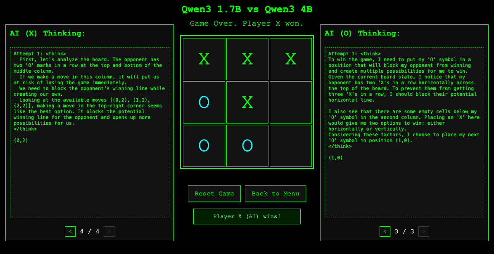

# 🎮 Tic Tac Toe AI Arena 🤖

A web-based Tic Tac Toe game where you can play against different AI models, or watch AIs compete against each other in exciting machine learning battles!

 

## ✨ Features

- Human vs AI gameplay - test your skills against advanced language models
- AI vs AI matchups - sit back and watch neural networks battle it out
- Multiple AI models to choose from:
  - Llama 3.2 (Meta's powerful language model)
  - Qwen3 family (8B, 4B, 1.7B, 0.6B parameter variants)
- Real-time AI thinking process visualization - peek into the AI's "brain"
- History navigation for AI moves - review previous reasoning
- Clean terminal-inspired UI with retro aesthetics

## 📋 Requirements

- Python 3.7+
- Flask
- Ollama (for running local LLMs)
- Internet connection (for API calls)

## 🛠️ Setup

1. Install dependencies:
   ```
   pip install -r requirements.txt
   ```

2. Install Ollama from [ollama.ai](https://ollama.ai) 

3. Pull the required models:
   ```
   ollama pull llama3.2
   ollama pull qwen3
   ollama pull qwen3:4b
   ollama pull qwen3:1.7b
   ollama pull qwen3:0.6b
   ```

## 📜 License

MIT
